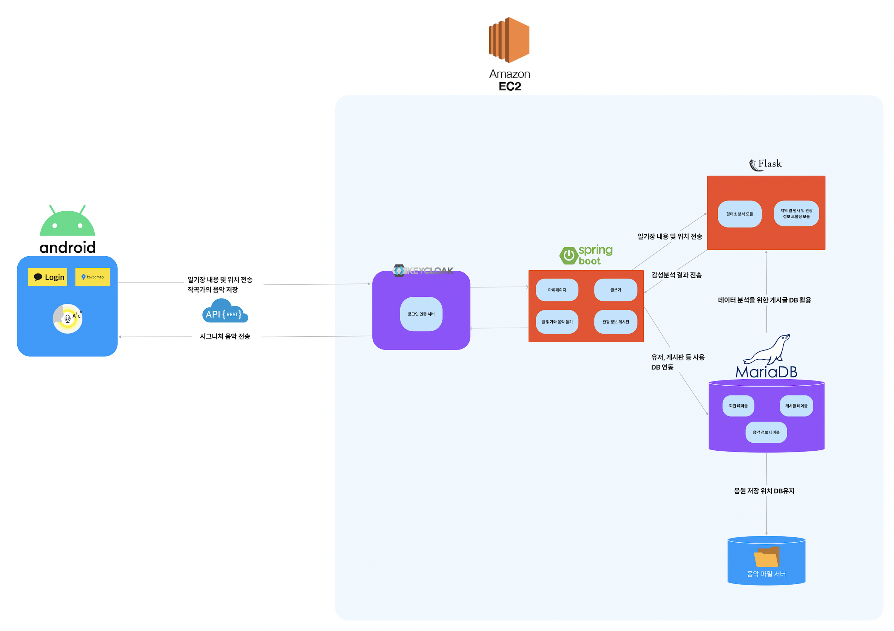

# 🎶 BERMUDA
> 2022 한국관광공사 카카오 주관 ‘2022 관광데이터 활용 공모전’ 장려상 수상 🎖️️

 
'BERMUDA'는 사용자가 일기작성시 감성분석을 통하여 알맞은 음악을 추천해주는 Application 이다. 또한 위치 정보를 포함하고 있어 주변에 있는 다른 사용자의 감성을 함께 공유할 수 있다.

  
## TOUR API 4.0

- 한국 관광공사에서 제공하는 여행 관련 오픈 API
- BERMUDA는 지역별 행사 및 관광정보를 이용

  
## MY Role
- Application UI 디자인
- Android Stuido를 사용하여 Front-End 측 개발 진행
- JWT Token, RetrofitAPI 를 이용. Back-End와 통신
- 한국관광공사의 데이터를 크롤링해 어플에 표시

  
 

    
## Result

### Find Password, ID - 아이디찾기, 비밀번호 찾기

 

 

    
### References
- [TOUR API 4.0](https://api.visitkorea.or.kr/#/)
- [2022 수상팀🎖](https://api.visitkorea.or.kr/#/cntBoardDetail?no=2/)

  
**Thank you**

